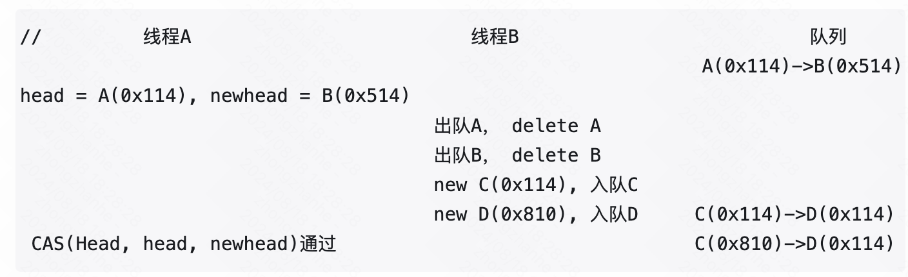

# 并发队列

参考

1. [并发无锁队列学习之一【开篇】](https://www.cnblogs.com/alantu2018/p/8469168.html)

线程间通信，网络通信。缓解数据处理压力。

1. 4种场景：单生产者——单消费者、多生产者——单消费者、单生产者——多消费者、多生产者——多消费者。可归纳为：
   1. 单对单
   2. 多对多

2. 根据队列中数据分为：队列中的数据是**定长的**、队列中的数据是**变长的**。

## 单对单——无锁并发队列

linux内核提供的kfifo的实现
[巧夺天工的kfifo(修订版）](https://blog.csdn.net/linyt/article/details/53355355)

功能：无锁字节流服务

1. fifo->in和out指针均为无符号整数，不进行回环处理，单调递增，即使发生无符号数回绕也不会有问题。因此不需要预留1个空间用来区分满/空

https://github.com/torvalds/linux/blob/v6.10/lib/kfifo.c#L394
1. 新版代码添加了recsize（最多2字节），用于识别字节流中的record。
2. 去除了许多内存屏障

[内存屏障(Memory Barriers)](https://www.cnblogs.com/icanth/archive/2012/06/10/2544300.html)
简单理解就是：

mb - mfence
rmb - lfence
wmb - sfence

## 多对多

正常逻辑操作是要对队列操作进行加锁处理。加锁的性能开销较大，一般采用无锁实现。无锁实现原理是CAS、FAA等机制。

使用链表实现多对多的变长无锁队列，参考：https://coolshell.cn/articles/8239.html

使用链表的方式实现变长无锁队列有一些缺点：

1. 频繁申请和释放空间，若配合内存池则有空间浪费问题
2. ABA问题，需要解决
3. 变长，不适合限制资源增长

推荐使用数组方式实现定长无锁并发队列，具体有两种方法：

1. 用数组作为资源池实现定长的链表式无锁队列。
   1. 自己基于《[无锁队列的实现》](https://coolshell.cn/articles/8239.html)中无锁链表的实现，进行改造。
   2. 但仍然有ABA问题，需要用引用计数防止释放的方式实现
   3. 存在问题：池化实现比较复杂，开销太大
2. 论文《Implementing Lock-Free Queues》的实现，需要使用double-CAS，先不考虑
3. intel dpdk提供的rte_ring实现：http://blog.csdn.net/linzhaolover/article/details/9771329

## ABA问题

问题的原理：https://blog.csdn.net/weixin_34309543/article/details/94260402


无锁栈的场景比较好理解：线程1想出栈，准备CAS设置新的head时，线程2接连pop A、pop B，delete B，push A。此时线程1错误以为head没有改过，改新head设置为B，造成操作。

综合来看还是方法1比较好。代价是浪费一些内存。或者还是用数组实现为定长队列吧。

1. 以无锁方式循环节点的一种很自然的办法就是让每个线程维护它自己的由未使用队列项所组成的私有空闲链表。
当一个入队线程需要一个新节点时，它尝试从线程本地空闲链表中删除一个节点。如果空闲链表为空， 就new一个新节点。当一个出队线程准备释放一个节点时，它将该节点放入线程本地空闲链表。因为链表是线程本地的，因此不需要很大的同步开销。只要每个线程入队和出队次数大致相同，这种设计的效果就非常好。如果两种操作次数不平衡，则需要更加复杂的技术。
1. double CAS（每一次赋值，将指针的count+1赋值给被赋值指针）。_InterlockedCompareExchange128，但128位原子操作可能有性能问题
https://zhuanlan.zhihu.com/p/352723264

```cpp
CAS(&tail.ptr–>next, next, <node, next.count+1>)
CAS(&Q–>Head, head, <next.ptr, head.count+1>)
```

其中next和head是将要赋的值，要将其中的count+1后赋值目标指针。（绕口..）

3. 让被访问的指针不被释放。

缺点是每次访问指针都多好多次原子操作。

```cpp
SafeRead(q)
{
    loop:
        p = q->next;
        if (p == NULL){
            return p;
        }

        Fetch&Add(p->refcnt, 1);

        if (p == q->next){
            return p;
        }else{
            Release(p);
        }
    goto loop;
}
```
其中的 Fetch&Add和Release分是是加引用计数和减引用计数，都是原子操作，这样就可以阻止内存被回收了。