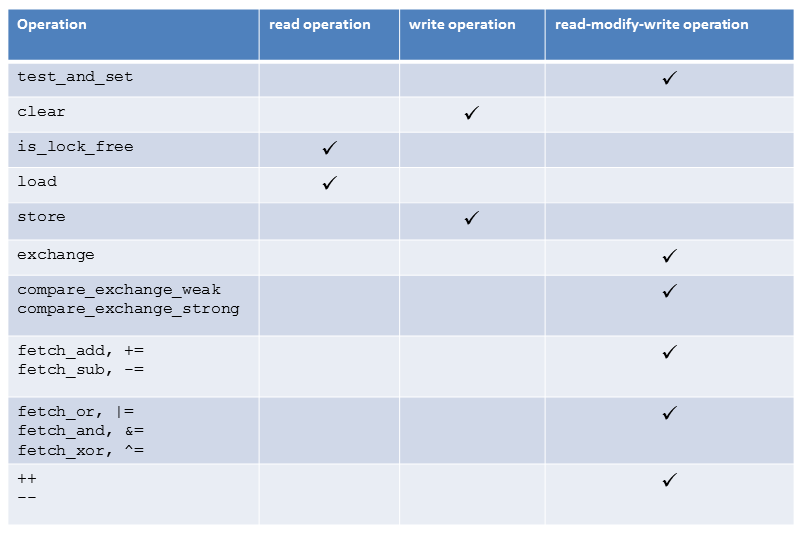
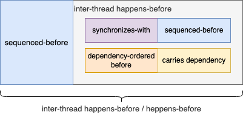
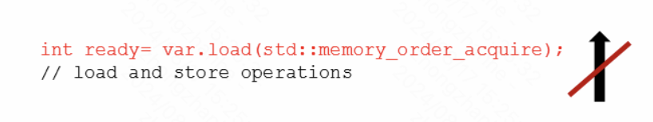
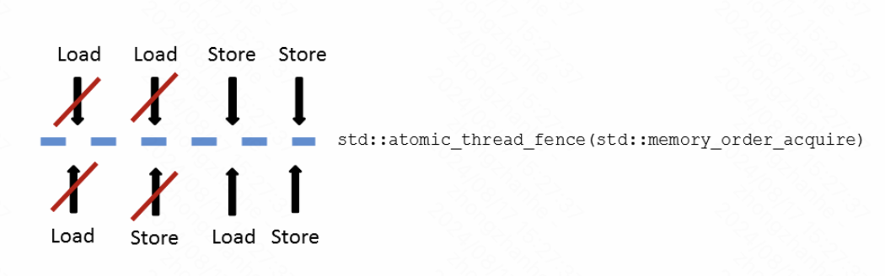

# 内存模型

## C++11 内存模型

外文文章：[Synchronization and Ordering Constraints](https://www.modernescpp.com/index.php/synchronization-and-ordering-constraints/)
[谈谈 C++ 中的内存顺序 (Memory Order)](https://luyuhuang.tech/2022/06/25/cpp-memory-order.html) （有各种原子操作的解释和样例，以及语义的解释）
[C++手册的内存模型定义](https://en.cppreference.com/w/cpp/atomic/memory_order#Relaxed_ordering)

C++11 支持6种内存模型。默认是最高级别的 memory_order_seq_cst

```cpp
enum memory_order{
  memory_order_relaxed,
  memory_order_consume,
  memory_order_acquire,
  memory_order_release,
  memory_order_acq_rel,
  memory_order_seq_cst
}
```

内存模型主要用来处理读/写操作的原子性。其中memory_order_relaxed没有任何的同步和排序约束。

- 读操作: memory_order_consume, memory_order_acquire
- 写操作: memory_order_release
- 读改写: memory_order_acq_rel, memory_order_seq_cst



注意注意：如果将原子操作atomVar.load(5)与设计用于写入或读取-修改-写入操作的内存模型一起使用，**则写入部分不起作用**。所以一个atomVar.load(5,std, std::memory_order_acq_rel)相当于一个atomVar.load(5,std::memory_order_acquire)，**一个atomVar.load(5, std::memory_order_release)相当于一个atomVar.load(5,std::memory_order_relaxed)**。

C++11 中有3种同步和顺序约束：

- **Sequential consistency**: memory_order_seq_cst 
- **Acquire-release**: memory_order_consume, memory_order_acquire, memory_order_release and memory_order_acq_rel
- **Relaxed**: memory_order_relaxed

顺序一致性在线程之间建立了全局顺序，而获取-释放语义则在不同线程上对同一原子变量的读取和写入操作之间建立了顺序。~~宽松的语义仅保证同一线程中对同一原子数据类型(变量)的操作不能重新排序。这种保证称为**修改顺序一致性**。但其他线程可以以不同的顺序看到此操作。~~ 宽松语义仅支持修改顺序。

各个内存模型的作用可以结合后面的 “C++11 内存屏障” 章节一起阅读。

C++11内存模型需要掌握的概念：

- Modification order（修改顺序）
- Sequenced-before

### Modification order

对特定原子变量的修改的操作，总是有一个总的顺序。这也是保证原子操作的内在要求。例如对一个原子变量a进行store操作，所有线程看到的修改顺序都是一致的，即线程1先看到a为3再看到为5，其他线程也应该看到相同的修改顺序。

### Sequenced-before

同一个线程内，A先于B执行，则A Sequenced-before B。该关系具有传递性。
感觉可以简单理解为书面上的代码先后顺序

### synchronizes-with

主要指线程之间的同步关系，thread1中的A和thread2中B操作有同步关系，简单理解就是：A发生后B才发生（不一定准确），实现同步关系的手段有：

1. mutex（或者其他同步库调用）
2. 同一原子变量的Acquire-release

### Carries dependency

在**同一线程**中，如果满足以下任一条件，则在求值 B 之前排序的求值 A 也可能对 B 具有依赖关系（即，B 依赖于 A）：

1) A的值用作B的操作数，除了
    1) 如果 B 是对 std::kill_dependency 的调用，
    2) 如果 A 是内置 &&、||、?: 或 , 运算符的左操作数。
2) A 写入标量对象 M，B 从 M 读取。
3) A 将依赖项带入另一个评估 X，而 X 将依赖项带入 B。

可以简单理解为编译优化中的依赖链概念，具有依赖顺序的指令之间是不能重排的

### Dependency-ordered before

在**线程之间**，如果满足以下任一条件，则计算 A 会在计算 B 之前按依赖顺序排序：

1) A 对某个原子 M 执行释放操作，并且在不同的线程中，B 对同一个原子 M 执行consume操作，B 读取到由A以释放序列为首的任何部分写入的值（直到 C++20 .
2) A dependency-ordered before X ，并且 X carries a dependency into B。

Dependency-ordered before 可以直接构成 inter-thread happens-before 的关系: 如果 a “dependency-ordered before” b 则 a “inter-thread happens-before” b.

### Inter-thread happens-before

Between threads, evaluation A inter-thread happens before evaluation B if any of the following is true:

1) A synchronizes-with B.
2) A is dependency-ordered before B.
3) A synchronizes-with some evaluation X, and X is sequenced-before B.
4) A is sequenced-before some evaluation X, and X inter-thread happens-before B.
5) A inter-thread happens-before some evaluation X, and X inter-thread happens-before B.

### Happens-before

如果满足以下任一条件，则 A 发生在评估 B 之前：

1) A sequenced-before B 。
2) A inter-thread happens before B 。


如果一个计算修改内存位置，而另一个计算读取或修改同一内存位置，并且至少其中一个计算不是原子操作，则程序的行为是未定义的（程序存在数据争用），除非存在这两个评估之间存在事前发生的关系。

## C++11 原子操作

### memory_order_relaxed

最宽松的语义。memory_order_relaxed 可以用于 store, load 和 read-modify-write 操作, 实现 relaxed 的顺序模型. 这种模型下, 只能保证操作的原子性和修改顺序 (modification order) 一致性, 无法实现 synchronizes-with 的关系.

典型应用场景是用来**递增**一个计数器，例如C++中std::shared_ptr就是使用了memory_order_relaxed递增计数器。注意：**递减shared_ptr计数器需要与析构函数进行获取-释放同步**。即要使用memory_order_release进行递减。

### Acquire-release

在 acquire-release 模型中, 会使用 memory_order_acquire, memory_order_release 和 memory_order_acq_rel 这三种内存顺序. 它们的用法具体是这样的:

- 对原子变量的 load 可以使用 memory_order_acquire 内存顺序. 这称为 acquire 操作.
- 对原子变量的 store 可以使用 memory_order_release 内存顺序. 这称为 release 操作.
- read-modify-write 操作即读 (load) 又写 (store), 它可以使用 memory_order_acquire, memory_order_release 和 memory_order_acq_rel:
  - 如果使用 memory_order_acquire, 则作为 acquire 操作;
  - 如果使用 memory_order_release, 则作为 release 操作;
  - 如果使用 memory_order_acq_rel, 则同时为两者.

Acquire-release 可以实现 synchronizes-with 的关系. 如果一个 acquire 操作在同一个原子变量上读取到了一个 release 操作写入的值, 则这个 release 操作 “synchronizes-with” 这个 acquire 操作. 

Acquire-release 的开销比 sequencial consistent 小. 在 x86 架构下, memory_order_acquire 和 memory_order_release 的操作不会产生任何其他的指令, 只会影响编译器的优化: 任何指令都不能重排到 acquire 操作的前面, 且不能重排到 release 操作的后面; 否则会违反 acquire-release 的语义. 因此很多需要实现 synchronizes-with 关系的场景都会使用 acquire-release.

更多了解：[Release sequences](https://luyuhuang.tech/2022/06/25/cpp-memory-order.html#release-sequences)

### memory_order_consume

https://luyuhuang.tech/2022/06/25/cpp-memory-order.html#memory_order_consume

基本思路是:

- release 操作和 acquire 操作构成的 synchronizes-with 可以后接 sequenced-before 构成 inter-thread happens-before 的关系;
- release 操作和 **consume** 操作构成的 dependency-ordered before 则只能后接 carries dependency 构成 inter-thread happens-before 的关系.
- 无论 inter-thread happens-before 是怎么构成的, 都可以前接 sequenced-before 以延伸其范围.



与 acquire-release 类似, 在 x86 下使用 memory_order_consume 的操作不会产生任何其他的指令, 只会影响编译器优化. 与 consume 操作有依赖关系的指令都不会重排到 consume 操作前面. 它对重排的限制比 acquire 宽松些, acquire 要求所有的指令都不能重排到它的前面, 而 consume 只要求有依赖关系的指令不能重排到它的前面. 因此在某些情况下, consume 的性能可能会高一些.

### memory_order_seq_cst

memory_order_seq_cst 可以用于 store, load 和 read-modify-write 操作, 实现 sequencial consistent 的顺序模型. 在这个模型下, **所有线程看到的所有操作都有一个一致的顺序, 即使这些操作可能针对不同的变量, 运行在不同的线程**.

### 与volatile 的联系

在执行线程中，通过易失性泛左值进行的访问（读取和写入）无法重新排序到同一线程内排序前或排序后的可观察副作用（包括其他易失性访问），但不能保证此顺序可以被另一个线程观察到，因为易失性访问不会建立线程间同步。

此外，易失性访问**不是原子性的**（并发读取和写入是数据竞争）并且不对内存进行排序（**非易失性内存访问可以围绕易失性访问自由地重新排序**）。

### compare_exchange_weak 和compare_exchange_strong区别

https://en.cppreference.com/w/cpp/atomic/atomic_compare_exchange

std::atomic_compare_exchange_weak 和 std::atomic_compare_exchange_weak_explicit （弱版本）允许虚假失败，也就是说，即使它们相等，也表现得好像 *obj != *expected 一样。当比较和交换处于循环中时，它们将在某些平台上产生更好的性能。

当 弱比较和交换 需要循环而 强比较和交换 不需要循环时，强比较和交换会更可取，除非 T 的对象表示可能包括填充位、（直到 C++20）陷阱位，或提供多个对象表示相同的值（例如浮点 NaN）。在这些情况下，弱比较和交换通常会起作用，因为它可以快速收敛到一些稳定的对象表示。

## C++11 内存屏障

外文文章（重点，有示意图）：[Fences are Memory Barriers](https://www.modernescpp.com/index.php/fences-as-memory-barriers/)
知乎文章（前面部分翻译上面外文的）：[c++ 内存屏障](https://zhuanlan.zhihu.com/p/605862480)
[std::atomic_thread_fence](https://blog.csdn.net/baidu_20351223/article/details/116126731)

According to cppreference, memory_order_seq_cst is equal to memory_order_acq_rel plus a single total modification order on all operations so tagged. But as far as I know, neither acquire nor release fence in C++11 enforces a #StoreLoad (load after store) ordering. A release fence requires that no previous read/write can be reordered with any following write; An acquire fence requires that no following read/write can be reordered with any previous read. Please correct me if I am wrong;

https://stackoverflow.com/questions/25478029/does-atomic-thread-fencememory-order-seq-cst-have-the-semantics-of-a-full-memo/39056569#39056569

通常，栅栏有三种：全栅(full fence)、获取栅栏(acquire fence)和释放栅栏(release fence)。

1. 全栅(full fence) (注意C++中并没有真正的全序)

```cpp

// load and store op 不能重排在fence之后的store操作之后

// 或者 std::atomic_thread_fence(std::memory_order_seq_cst);
// 或者 std::atomic_thread_fence();
std::atomic_thread_fence(std::memory_order_acq_rel); 

// load and store op 不能重排在fence之前的load操作之前
```

保证以下顺序：

- loadload
- loadstore
- storestore

在c++的标准定义里，full fence并没有规定一定要阻止storeload重排。但是在实际的实现上编译器大都是采用了硬件层面的能够阻止storeload重排的full barrier指令

`std::atomic_thread_fence(std::memory_order_seq_cst)`的不同点在于额外保证了memory_order_seq_cst operation之间的全局顺序一致性。

2. 获取栅栏(acquire fence)

```cpp
std::atomic_thread_fence(std::memory_order_acquire); 

// load and store op 不能重排在fence之前的load操作之前
```

保证以下顺序：

- loadload
- loadstore

3. 释放栅栏(release fence)

```cpp
// load and store op 不能重排在fence之后的store操作之后

std::atomic_thread_fence(std::memory_order_release); 
```

保证以下顺序：

- loadstore
- storestore

## C++11 原子操作和内存屏障的区别

外文文章（文中有一些程序样例）：[Acquire-Release Fences](https://www.modernescpp.com/index.php/acquire-release-fences/)

1. **栅栏不需要原子操作**。还有一个更微妙的区别：获取-释放栅栏比原子操作更重量级。（可能原因是栅栏是针对所有变量的load和store操作的，而原子操作只针对同一个原子变量）
2. 获取-释放操作是成对出现的。此外，**对获取-释放语义的原子变量的操作，必须作用在相同的原子变量上**。

为了说明栅栏和原子操作的区别，这里以acquire语义为例子进行分析。release语义也是类似的作用，不重复分析。

(1) 原子操作的作用如下，仅仅限制之后的读写操作不能重排在该原子acquire操作之前


(2) 栅栏的作用如下，限制之后的读写操作不能重排在栅栏前面的所有读操作之前


## X86 TSO

随着执行的进行，SC 要求每个核心为连续操作的所有四种组合保留其加载和存储的程序顺序：
Load -> Load
Load -> Store
Store -> Store
Store -> Load /* Included for SC but omitted for TSO */
TSO 包括前三个约束，但不包括第四个。

**TSO只不保证store-load顺序**。

x86-TSO中唯一重排的地方在于StoreBuffer，因为StoreBuffer的存在，核心的写入操作被缓存，无法马上刷新到共享存储中被其他核心观察到，所以就有了 “ 写 ” 比 “读” 晚执行的直观感受，也可以说是读操作提前了，排到了写操作前

https://zhuanlan.zhihu.com/p/552963779
https://www.cnblogs.com/lqlqlq/p/13693876.html
https://blog.csdn.net/yiyeguzhou100/article/details/130546421

## C++ 如何实现 storeload序

https://stackoverflow.com/questions/60053973/how-to-achieve-a-storeload-barrier-in-c11

初步结论：使用 store(seq_cst) fence(seq_cst) load(seq_cst) 可以保证顺序

## C++11如何映射到各个处理器

https://www.cl.cam.ac.uk/~pes20/cpp/cpp0xmappings.html

https://gcc.gnu.org/bugzilla/show_bug.cgi?id=91719

## 一些实战例子

### 自旋锁

https://luyuhuang.tech/2022/06/25/cpp-memory-order.html#%E8%87%AA%E6%97%8B%E9%94%81

```cpp
class spinlock {
    std::atomic<bool> flag{false};
public:
    void lock() {
        while (flag.exchange(true, std::memory_order_acquire)); // (1)
    }
    void unlock() {
        flag.store(false, std::memory_order_release); // (2)
    }
};
```

### 线程安全的单例模式

https://luyuhuang.tech/2022/06/25/cpp-memory-order.html#%E7%BA%BF%E7%A8%8B%E5%AE%89%E5%85%A8%E7%9A%84%E5%8D%95%E4%BE%8B%E6%A8%A1%E5%BC%8F

```cpp
class App {
    static std::atomic<App*> instance;
    static std::mutex mu;
public:
    static App *get_instance() {
        auto *p = instance.load(std::memory_order_acquire); // (1)
        if (!p) {
            std::lock_guard<std::mutex> guard(mu);
            if (!(p = instance.load(std::memory_order_relaxed))) { // (2)
                p = new App;
                instance.store(p, std::memory_order_release); // (3)
            }
        }
        return p;
    }
};
```

C++11实现多线程条件下的单例模式使用静态局部变量只初始化一次且线程安全的语法特性就行了，不用加锁

```cpp
class Singleton
{
public:
    static Singleton& getInstance()
    {
        static Singleton value;
        return value;
    }
private:
    Singleton() = default;
    Singleton(const Singleton &rhs) = delete;
    Singleton &operator=(const Singleton &rhs) = delete;
};
```

## 更多参考

https://www.modernescpp.com/index.php/tag/acquire-release-semantic/
